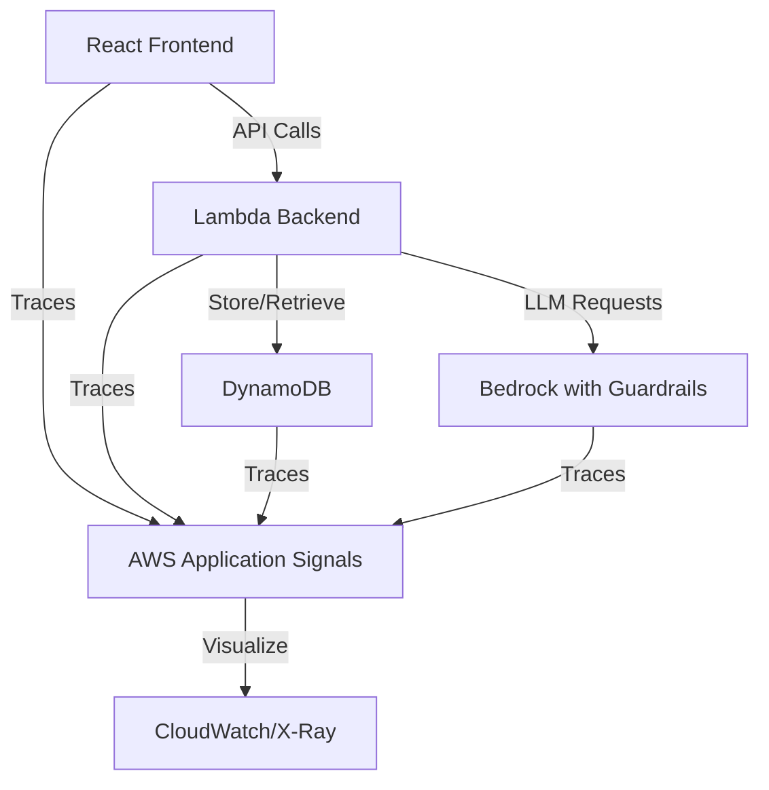
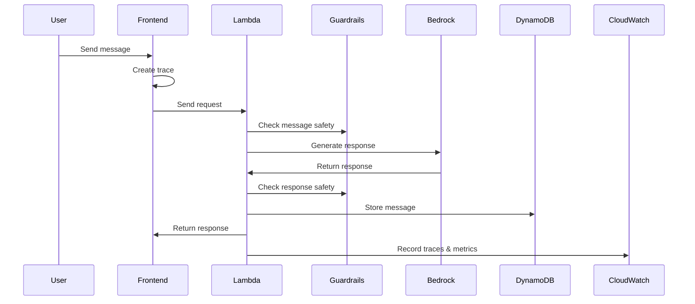

# LLM Observability Demo

This repository demonstrates how to implement comprehensive observability for LLM-powered applications using AWS Application Signals and OpenTelemetry. The demo showcases end-to-end tracing capabilities across a simple chat application, with safety monitoring through Amazon Bedrock Guardrails.

## Objective

The primary objectives of this demo are to:

1. Demonstrate how to implement observability in a full-stack LLM-powered application using AWS Application Signals
2. Showcase distributed tracing from frontend to backend to database using OpenTelemetry
3. Illustrate how to monitor LLM safety using Amazon Bedrock Guardrails and integrate these metrics into your observability solution
4. Provide a practical example of how technical decision makers can implement and benefit from observability in AI/ML applications


## What You Will Learn

Through this demo, you will understand:

- How to correlate traces across service boundaries (frontend, Lambda, DynamoDB) using AWS Application Signals
- How to monitor and visualize trace data in CloudWatch and X-Ray
- How to integrate Amazon Bedrock Guardrails safety scores into your observability solution

## Architecture

The demo consists of a simple chat application with the following components:



### Components

- **Frontend**: React application hosted on Amazon CloudFront
  - Instrumented with OpenTelemetry for client-side tracing
  - Sends traces to AWS Application Signals

- **Backend**: AWS Lambda functions
  - Processes chat messages
  - Integrates with Amazon Bedrock for LLM capabilities
  - Implements Bedrock Guardrails for content safety
  - Instrumented with OpenTelemetry for server-side tracing

- **Database**: Amazon DynamoDB
  - Stores chat history
  - Operations are traced through AWS Application Signals

- **Observability Stack**:
  - AWS Application Signals for collecting and correlating traces
  - Amazon CloudWatch for metrics and logs visualization
  - AWS X-Ray for distributed tracing visualization
  - Custom dashboards for Bedrock Guardrails safety scores

### Data Flow

1. User sends a message through the React frontend
2. Frontend creates a trace and sends the request to the Lambda backend
3. Lambda processes the message, checks it with Bedrock Guardrails, and stores it in DynamoDB
4. Lambda generates a response using Amazon Bedrock, applies Guardrails, and returns it to the frontend
5. All operations are traced and can be visualized in CloudWatch and X-Ray
6. Safety scores from Bedrock Guardrails are recorded as custom metrics



## Project Structure

The project follows a modular structure with clear separation of concerns:

```
llm-observability-demo/
├── cdk/                           # CDK infrastructure code
├── src/                           # Application source code
│   ├── backend/                   # Lambda function code
│   ├── frontend/                  # React application
│   └── shared/                    # Shared code and types
└── README.md
```

## Prerequisites

- AWS Account with appropriate permissions
- AWS CLI installed and configured
- Node.js (v20 or later) and npm
- Python 3.10 or later
- AWS CDK installed globally (`npm install -g aws-cdk`)
- Docker (for local testing)

## Setup Instructions

### 1. Clone the Repository

```bash
git clone https://github.com/your-org/llm-observability-demo.git
cd llm-observability-demo
```

### 2. Install Dependencies

```bash
npm run install:all
```

### 3. Build and Deploy

```bash
npm run build
npm run deploy
```

The deployment script will:
1. Build the frontend React application
2. Deploy the CDK stack with all AWS resources
3. Extract the Lambda function URL from the CDK outputs
4. Inject the Lambda function URL into the frontend configuration
5. Output the CloudFront URL where you can access the application

## CDK Implementation Approach

This project uses AWS CDK to deploy all components with a focus on AWS best practices:

### Backend implementation

We use separated AWS CDK constructs instead of AWS Solutions Constructs for better customization:

```typescript
import * as lambda from 'aws-cdk-lib/aws-lambda';
import * as dynamodb from 'aws-cdk-lib/aws-dynamodb';
import * as iam from 'aws-cdk-lib/aws-iam';
import * as bedrock from '@cdklabs/generative-ai-cdk-constructs';
import { Duration } from 'aws-cdk-lib';

// Create DynamoDB table
const chatTable = new dynamodb.Table(this, 'ChatTable', {
  partitionKey: { name: 'id', type: dynamodb.AttributeType.STRING },
  sortKey: { name: 'timestamp', type: dynamodb.AttributeType.NUMBER },
  timeToLiveAttribute: 'ttl',
  billingMode: dynamodb.BillingMode.PAY_PER_REQUEST,
  removalPolicy: cdk.RemovalPolicy.DESTROY, // For demo purposes only
});

// Create Bedrock Guardrails
const guardrails = new bedrockGuardrails.Guardrail(this, 'ChatGuardrails', {
  name: 'llm-observability-guardrails',
  description: 'Guardrails for LLM observability demo',
});

// Add content filters
guardrails.addContentFilter({
  type: filters.ContentFilterType.HATE,
  threshold: filters.FilterThreshold.MEDIUM,
});

// Create a version for deployment - we'll use DRAFT to always get the latest version
const guardrailVersion = 'DRAFT';

// Create a Lambda Layer with AWS Distro for OpenTelemetry Lambda
// https://aws-otel.github.io/docs/getting-started/lambda/lambda-js
const powertoolsLayer = LayerVersion.fromLayerVersionArn(
  this,
  'ADOTJSLayer',
  `arn:aws:lambda:${Stack.of(this).region}:901920570463:layer:aws-otel-nodejs-amd64-ver-1-30-1:2`
);

const chatFunction = new lambda.Function(this, 'ChatFunction', {
  runtime: lambda.Runtime.NODEJS_18_X,
  code: lambda.Code.fromAsset(path.join(__dirname, '../src/backend')),
  handler: 'index.handler',
  timeout: Duration.minutes(5), // Extended for streaming responses
  tracing: lambda.Tracing.ACTIVE, // Enable tracing
  environment: {
    TABLE_NAME: chatTable.tableName,
    GUARDRAIL_ID: guardrails.guardrailId,
    GUARDRAIL_VERSION: guardrailVersion,
    AWS_LAMBDA_EXEC_WRAPPER: '/opt/otel-handler'
  }, // Thanks to AWS_LAMBDA_EXEC_WRAPPER, Lambda execution is traced by otel-hander.
  layers: [powertoolsLayer]
});
```

### Frontend implementation

Backend Lambda function is called from frontend React Application.

* Application send the model id and chat message (with history) to backend endpoint.
* Application write streaming message received from endpoint.
* Received message is rendered as markdown.

## Clean Up

To avoid incurring charges, clean up the resources when you're done:

```bash
npm run destroy
```

## Additional Resources

- [AWS Application Signals Documentation](https://docs.aws.amazon.com/application-signals/)
- [OpenTelemetry Documentation](https://opentelemetry.io/docs/)
- [Amazon Bedrock Guardrails Documentation](https://docs.aws.amazon.com/bedrock/latest/userguide/guardrails.html)
- [AWS Lambda with OpenTelemetry](https://aws.amazon.com/blogs/compute/instrumenting-aws-lambda-functions-with-opentelemetry/)
- [AWS Solutions Constructs](https://docs.aws.amazon.com/solutions/latest/constructs/)
- [GenAI CDK Constructs](https://github.com/awslabs/generative-ai-cdk-constructs)

## License

This project is licensed under the MIT License - see the LICENSE file for details.