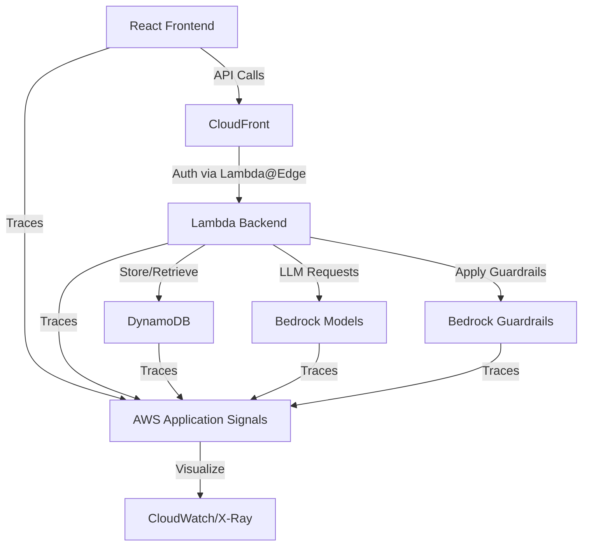
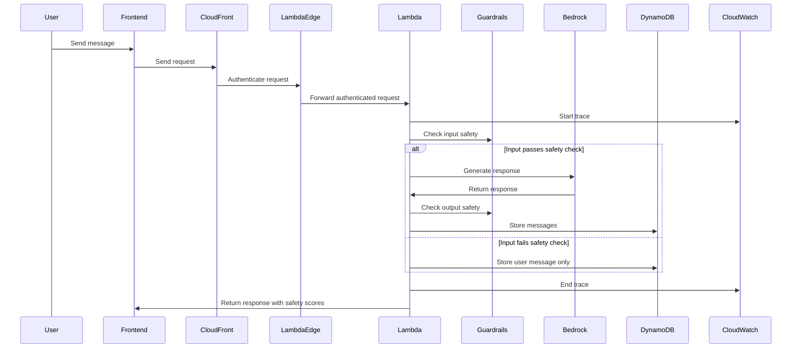

# LLM Observability Demo

This repository demonstrates how to implement comprehensive observability for LLM-powered applications using AWS Application Signals and OpenTelemetry. The demo showcases end-to-end tracing capabilities across a simple chat application, with safety monitoring through Amazon Bedrock Guardrails.

## Objective

The primary objectives of this demo are to:

1. Demonstrate how to implement observability in a full-stack LLM-powered application using AWS Application Signals
2. Showcase distributed tracing from frontend to backend to database using OpenTelemetry
3. Illustrate how to monitor LLM safety using Amazon Bedrock Guardrails and integrate these metrics into your observability solution
4. Provide a practical example of how technical decision makers can implement and benefit from observability in AI/ML applications

## What You Will Learn

Through this demo, you will understand:

- How to correlate traces across service boundaries (frontend, Lambda, DynamoDB) using AWS Application Signals
- How to monitor and visualize trace data in CloudWatch and X-Ray
- How to integrate Amazon Bedrock Guardrails safety scores into your observability solution

## Architecture

The demo consists of a simple chat application with the following components:



### Components

- **Frontend**: React application hosted on S3 and served through CloudFront
  - Instrumented with OpenTelemetry for client-side tracing
  - Sends traces to AWS Application Signals

- **Authentication**: Lambda@Edge function
  - Secures API calls through CloudFront
  - Handles request signing for Lambda function URL authentication

- **Backend**: AWS Lambda functions
  - Processes chat messages
  - Integrates with Amazon Bedrock for LLM capabilities (Claude 3.7 and Amazon Nova Pro)
  - Implements Bedrock Guardrails for content safety
  - Instrumented with OpenTelemetry for server-side tracing

- **Database**: Amazon DynamoDB
  - Stores chat history
  - Operations are traced through AWS Application Signals

- **Content Safety**: Amazon Bedrock Guardrails
  - Implements content filters for hate speech, sexual content, and violence
  - Configured with LOW strength for both input and output filtering

- **Observability Stack**:
  - AWS Application Signals for collecting and correlating traces
  - Amazon CloudWatch for metrics and logs visualization
  - AWS X-Ray for distributed tracing visualization
  - Custom metrics for Bedrock Guardrails safety scores

### Data Flow

1. User sends a message through the React frontend
2. Request passes through CloudFront to the Lambda@Edge function for authentication
3. Lambda@Edge authenticates and forwards the request to the Lambda function URL
4. Lambda processes the message and applies Bedrock Guardrails to check input safety
5. If the message passes safety checks, Lambda invokes Bedrock model (Claude 3.7 or Nova Pro)
6. Lambda applies Guardrails to the model response to check output safety
7. Lambda stores both user message and model response in DynamoDB
8. Lambda returns the response with safety scores to the frontend
9. All operations are traced and can be visualized in CloudWatch and X-Ray



## Project Structure

The project follows a modular structure with clear separation of concerns:

```
sample-llm-observability/
├── cdk/                           # CDK infrastructure code
│   ├── bin/                       # CDK app entry point
│   └── lib/                       # CDK stack definition
├── src/                           # Application source code
│   ├── backend/                   # Lambda function code
│   │   ├── src/                   # Backend source code
│   │   └── tests/                 # Backend tests
│   ├── frontend/                  # React application
│   │   ├── public/                # Static assets
│   │   └── src/                   # Frontend source code
│   │       ├── components/        # React components
│   │       └── services/          # API services
│   └── shared/                    # Shared code and types
└── README.md
```

## Prerequisites

- AWS Account with appropriate permissions
- AWS CLI installed and configured
- Node.js (v20 or later) and npm
- AWS CDK installed globally (`npm install -g aws-cdk`)

## Setup Instructions

### 1. Clone the Repository

```bash
git clone https://github.com/your-org/sample-llm-observability.git
cd sample-llm-observability
```

### 2. Install Dependencies

```bash
npm ci
```

### 3. Configure AWS Credentials

Ensure your AWS credentials are properly configured:

```bash
aws configure
```

### 4. Build and Deploy

```bash
npm run cdk:deploy
```

The deployment script will:
1. Build the frontend React application
2. Build the backend Lambda functions
3. Deploy the CDK stack with all AWS resources

For faster deployment during development, you can use:

```bash
npm run cdk:deploy:quick
```

Or for hot-swapping Lambda code changes:

```bash
npm run cdk:deploy:hotswap
```

## Clean Up

To avoid incurring charges, clean up the resources when you're done:

```bash
npm run cdk:destroy
```

## Additional Resources

- [AWS Application Signals Documentation](https://docs.aws.amazon.com/application-signals/)
- [OpenTelemetry Documentation](https://opentelemetry.io/docs/)
- [Amazon Bedrock Guardrails Documentation](https://docs.aws.amazon.com/bedrock/latest/userguide/guardrails.html)
- [AWS Lambda with OpenTelemetry](https://aws.amazon.com/blogs/compute/instrumenting-aws-lambda-functions-with-opentelemetry/)
- [AWS Solutions Constructs](https://docs.aws.amazon.com/solutions/latest/constructs/)
- [GenAI CDK Constructs](https://github.com/awslabs/generative-ai-cdk-constructs)

## License

This project is licensed under the MIT License - see the LICENSE file for details.
